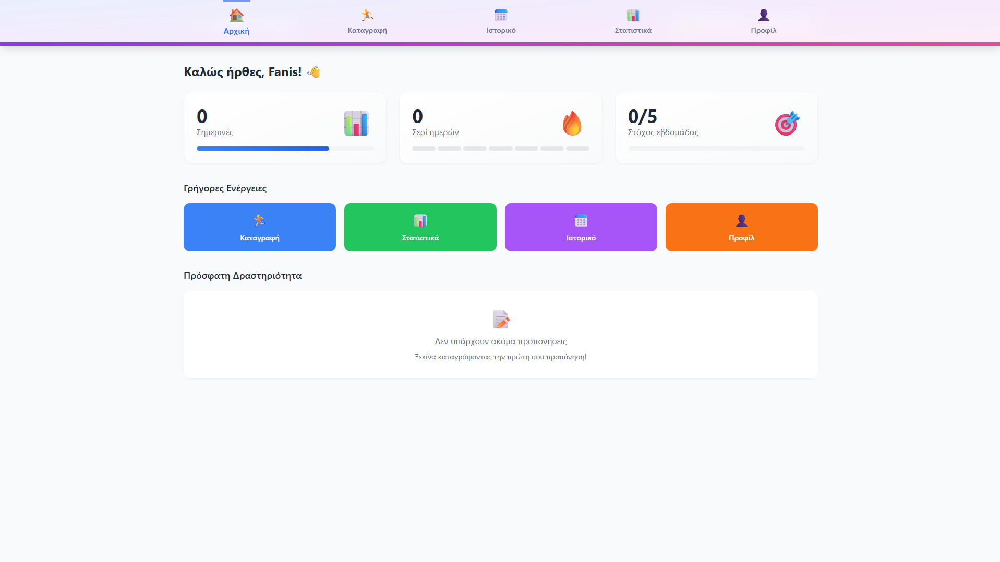
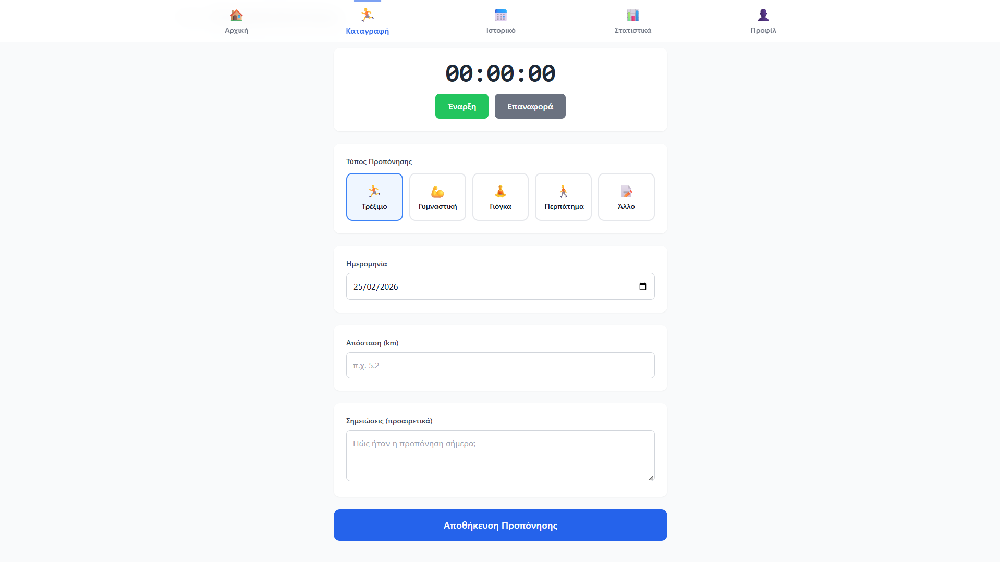
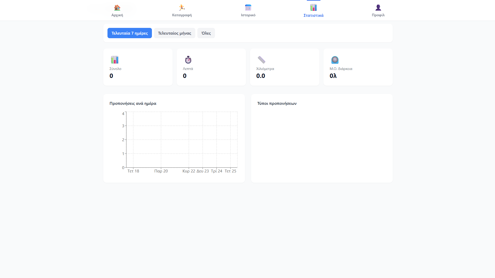
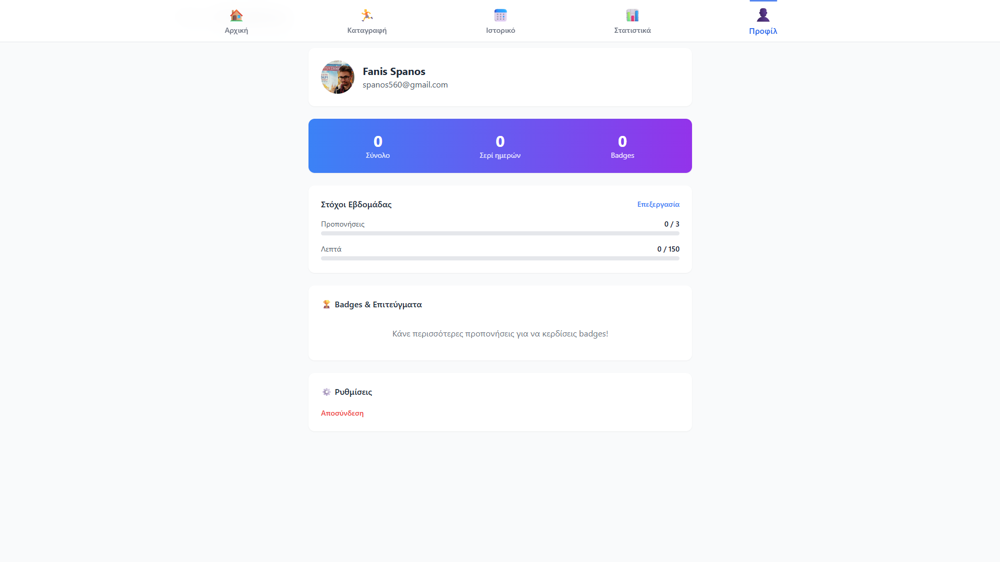

# 💪 Fitness Tracker v1.0 (alpha)

A modern full-stack fitness tracking application built with React, TypeScript, and Firebase. Track your workouts, monitor progress, connect with friends, and achieve your fitness goals!

## 📸 Screenshots

### Dashboard

*Central dashboard with statistics, challenges, and activity feed*

### Track Workout

*Workout logging with stopwatch and type selection*

### Statistics

*Detailed statistics with charts and personal records*

### Profile & Achievements

*User profile with badges, goals, and challenges*

## ✨ Features

### 🏋️‍♂️ Core Features (v1.0)
- 🔐 **Google Authentication** - Secure login with Google account
- 🏃 **Workout Tracking** - Log running, gym, yoga, walking sessions
- ⏱️ **Stopwatch Timer** - Track workout duration with haptic feedback
- 📊 **Statistics & Charts** - Visual progress tracking with Recharts
- 📅 **Activity History** - Workout history with filters
- 🎯 **Goal Setting** - Weekly workout targets
- 🏆 **Achievement Badges** - Unlock badges for milestones

### 👥 Social Features
- 🤝 **Follow System** - Follow other users
- ❤️ **Likes & Comments** - Interact with friends' workouts
- 🔔 **Notifications** - Get notified for follows, likes, comments
- 👀 **Friend Activity** - See what your friends are doing
- 🔍 **User Search** - Discover and connect with new people

### 🎯 Challenges & Gamification
- 🧘 **30 Days of Yoga** - Daily yoga for 30 days
- 🏃 **100km Running** - Complete 100 kilometers of running
- 💪 **7-Day Gym Streak** - Workout for 7 consecutive days
- 📊 **Progress Tracking** - Visual progress representation
- ✨ **Achievement System** - Unlock badges and rewards

### 🎨 UI/UX
- 🌙 **Dark/Light Mode** - Theme switching with system preference
- 🇬🇷🇬🇧 **Multilingual** - Full Greek and English support
- 📱 **Mobile First** - Fully responsive design
- ✨ **Smooth Animations** - Fluid transitions and micro-interactions
- 🎨 **Modern Design** - Glassmorphism, gradient cards, activity rings

### 📱 PWA Features
- 💾 **Installable** - Add to home screen on mobile devices
- 🚀 **Fast Loading** - Optimized for quick loading
- 🔄 **Auto Updates** - Automatic updates when online

## 🛠️ Technologies

### Frontend
- **React 19** - UI library
- **TypeScript** - Type safety
- **Vite** - Build tool
- **Tailwind CSS** - Styling
- **Zustand** - State management
- **Recharts** - Charts & graphs
- **date-fns** - Date manipulation
- **React Router DOM** - Routing
- **React Hot Toast** - Notifications

### Backend
- **Firebase Authentication** - User management
- **Firestore** - NoSQL database
- **Firebase Storage** - File storage (avatars)

### Development Status
- **Current Version:** v1.0.0-alpha
- **Status:** 🚧 Under active development
- **Next Features:**
  - Workout plans & routines
  - Advanced analytics
  - Social leaderboards
  - Custom challenges
  - Export data (PDF/CSV)

## 🚀 Live Demo

[View Live Demo](https://fitness-tracker-sepia-one.vercel.app)

## 🏗️ Installation

### Prerequisites
- Node.js 18+
- npm or yarn
- Firebase account

1. Clone the repository
```bash
git clone https://github.com/Pofalors/fitness-tracker.git
```

2. Install dependencies
```bash
cd fitness-tracker
npm install
```

3. Firebase Configuration

- Create a Firebase project
- Enable Authentication (Google provider)
- Create Firestore Database
- Set up Storage bucket (for avatars)
- Copy your config keys

4. Create `.env` file with Firebase config
```env
VITE_FIREBASE_API_KEY=your_api_key
VITE_FIREBASE_AUTH_DOMAIN=your_auth_domain
VITE_FIREBASE_PROJECT_ID=your_project_id
VITE_FIREBASE_STORAGE_BUCKET=your_storage_bucket
VITE_FIREBASE_MESSAGING_SENDER_ID=your_sender_id
VITE_FIREBASE_APP_ID=your_app_id
```

5. Run development server
```bash
npm run dev
```

## 📁 Project Structure
```
fitness-tracker/
├── src/
│   ├── components/         # Reusable components
│   │   ├── auth/           # Authentication components
│   │   ├── challenges/      # Challenges UI
│   │   ├── common/         # Shared components
│   │   ├── layout/         # Layout components
│   │   ├── notifications/   # Notification system
│   │   ├── settings/       # Theme/Language toggles
│   │   ├── social/         # Social features
│   │   └── tracking/       # Workout tracking
│   ├── pages/              # Page components
│   ├── store/              # Zustand stores
│   ├── types/              # TypeScript types
│   ├── services/           # Firebase services
│   ├── config/             # Configuration
│   └── utils/              # Utilities
├── public/                 # Static assets
└── screenshots/            # Documentation images
```

## 📱 PWA Installation

The app can be installed on mobile devices:
- **iOS:** Open the app in Safari → Tap the Share button (📤) → Select "Add to Home Screen" → Tap "Add"
- **Android:** Open the app in Chrome → Tap the menu (⋮) → Select "Install App" → Tap "Install"
- **Desktop:** Open the app in Chrome/Edge → Click the install icon in the address bar → Select "Install"

## 🤝 Contributing

Contributions are welcome! Feel free to open issues or submit PRs.

1. Fork the repository
2. Create your feature branch (git checkout -b feature/amazing-feature)
3. Commit your changes (git commit -m 'Add some amazing feature')
4. Push to the branch (git push origin feature/amazing-feature)
5. Open a Pull Request

## 📄 License

MIT License - see the LICENSE file for details

# ⭐ Star this project on GitHub if you like it! ⭐
